## WISE-PaaS/Dashboard 基于Grafana的加值说明

## Why Grafana ?

## 1. 更适合工业物联网场景数据

IoT领域采集的数据较多是时间序列数据，各类传感器采集的工业现场数据可快速接入在众多panel上进行展现，Grafana专注于时间序列数据的显示，对各类时序数据库都有很好的支持，显示插件对于时序数据的支持也是优先。 

## 2. 多租户和多维度的权限控制

支持多租户的场景，使用Org区分不同的用户，数据源和dashboard进行隔离。多种用户角色，除了支持用户也支持Team的管理。多维度的权限控制，支持org，folder，dashboard三层的权限控制，可满足各种使用场景。 

## 3. 仪表板和可视化

Grafana支持众多的显示panel，可帮助您快速构建各类显示效果，满足各类场景的需求，同时通过简单的拖拉缩放即可快速进行排版布局，操作简易方便。支持变量，注释的特性，可方便制作动态panel，同一张dashboard通过动态切换变量更换显示的数据。 

## 4. 数据源和集成

支持众多的数据源，内置集成Graphite，Prometheus，InfluxDB，MySQL，PostgreSQL和Elasticsearch等内置插件，另外支持众多的第三方数据源的插件，并可自行进行扩展。方便接入更多的数据来源并进行显示。每种数据源有自己特性化的查询编辑器，帮助用户简单方便掌握各类数据的查询配置 

## Why Grafana ?

## 5. 警报和通知

Grafana附带内置警报引擎，允许用户设置一定的条件规则到特定的panel上，数据刷新警报触发之后，可产生一系列的事件，并内置插件支持显示，同时结合notification通知功能，警报触发之后可自动发送通知，支持的方式众多（例如, Email, Slack, LINE, Telegram, 自定义的webhook等） 

## 6. 和Prometheus，Loki 集成度高

Prometheus是一个领先的开源监控解决方案，属于一站式监控告警平台，依赖少，功能齐全。Loki是一个可水平伸缩、高可用、多租户的日志聚合系统。在grafana上都有高度的集成和方便的使用。 

## 7. 插件化的结构，更易于扩展

Grafana 是插件化的架构，对于 panel，data source，app 都可以开发插件进行扩展，插件的开发轻量简易，放入指定插件目录下注册即可生效。对于显示效果的增加或是更多数据源的接入都可以轻松解决。 

## 8. 开源社区

拥有强大的用户社区和活跃的贡献者，它已拥有54个数据源，50个面板，17个应用程序和1732个仪表盘。在github上有25000多次提交，并且Star为35.6K之多，持续更新，快速进版增加新功能。 

## WISE-PaaS/Dashboard 基于Grafana的加值

保证系统的兼容性和稳定性 

2 

新增10大增强功能模块 

3 

新增低代码应用构建框架 

移动端排版和Mobile App支持 

4 

5 

新增25支各行业的显示插件 

6 

新增9支数据源插件，无缝接入平台数据 

7 

17支增强或维护的第三方插件 

8 

插件商城，插件开发生态 

9 

完善的培训和技术资料 

10 

技术支持和客制化开发 

## 保证系统的兼容性和稳定性

## 保证系统的兼容性和稳定性

定期和Grafana开源版本整合，加入开源版本的新特性，保证已发布的功能向下兼容 

WISE-PaaS/Dashboard 

WISE-PaaS/Dashboard保证和自有开发的数据源和显示插件的兼容性 

WISE-PaaS/Dashboard保证和纳入发布的第三方插件的兼容性 

修改Grafana开源版本和第三方插件的bug 

## 保证兼容性，才能保证升级系统的稳定性

和Grafana新版整合的过程中开源版本向下不兼容 

第三方插件没有及时更新和维护，在Grafana新版不能使用 

Grafana对接的数据源的数据结构有变化不兼容，比如6.5.2对table或timeserie类型返回数据中自定义的字段不支持 

Enabling an Intelligent Planet 

## 新增10大增强功能模块

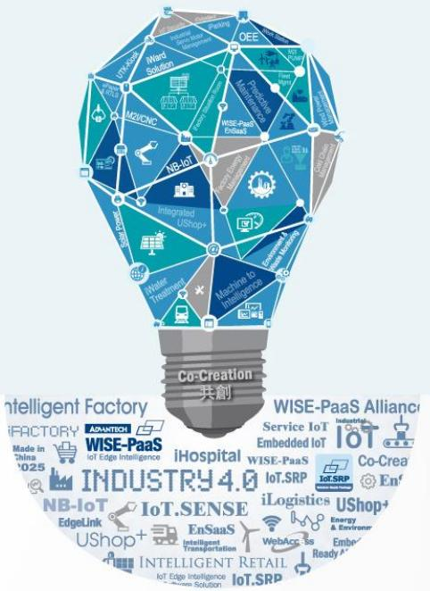

## 功能1 - Logo更换

## - Dashboard logo更换

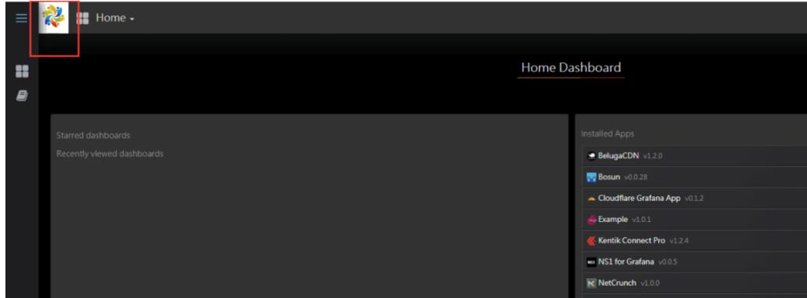

## - SRP-Frame框架logo更换

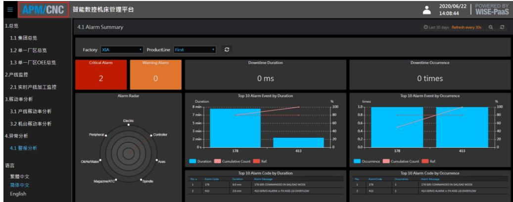

## 功能2 - 图片管理

Dashboard中增加图片服务器的功能主要为方便各种panel使用图片 

可进行图片上传，删除等管理功能，上传之后可粘贴图片的url，方便在SRP-Frame的logo，dashboard logo，Infographic, PictureIt panel中使用 

PictureIt 中和图片上传功能整合，可直接选中上传的列表中的图片 

支持上传的图片格式：bmp，jpg，jpeg，png，gif，svg 

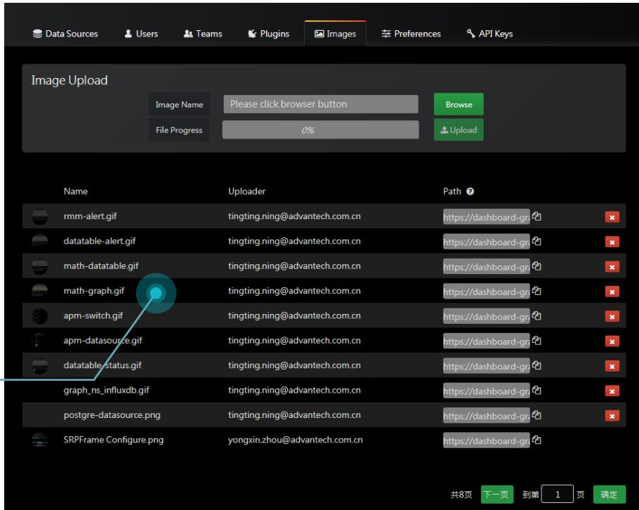

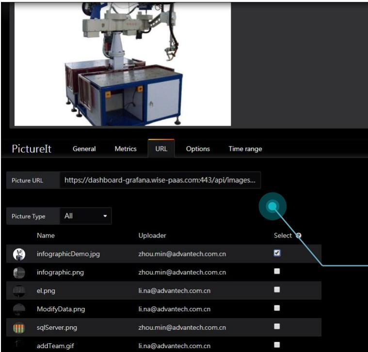

在PictureIt中选择图片上传的图片使用

## 功能3 - 插件管理

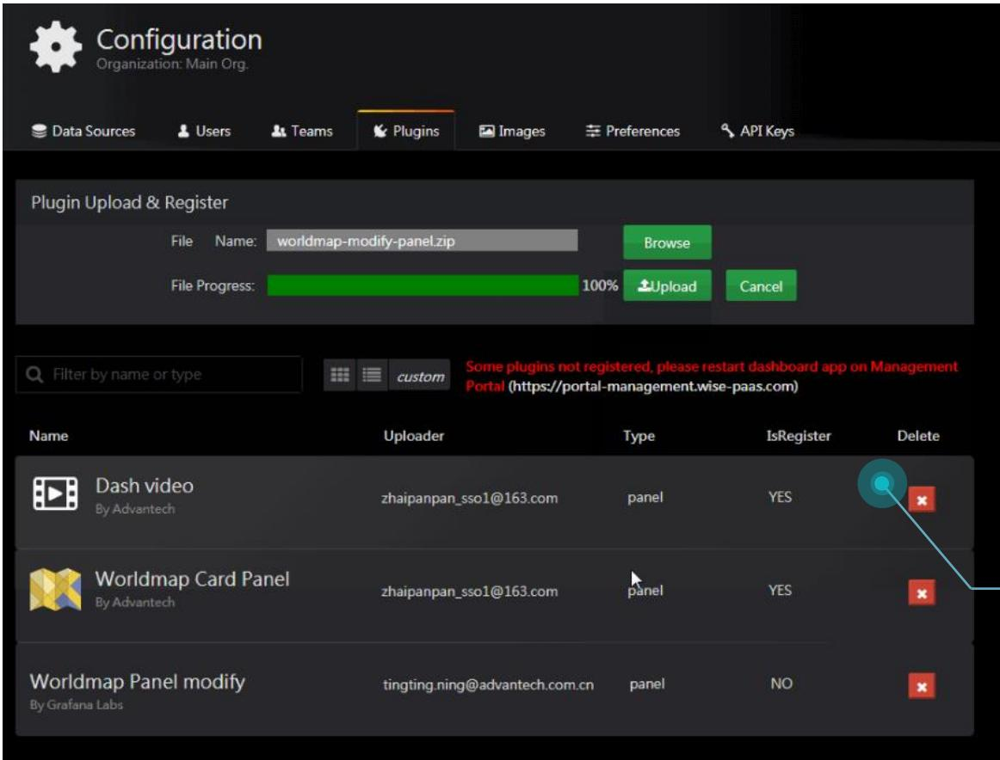

## 插件管理：

支持用户自己开发的插件上传使用 

➢ 方便用户测试自己开发的插件 

➢ 方便第三方社区的插件载入使用 

▶ 支持插件管理，删除 

## 用法：

将要上传的plugin文件压缩成.zip格式的文件，通过上传即可注册生效 

插件上传和管理 

## 功能4 - org的批量导入导出

## 备份：

批量导出某个org或多个org的dashboard，数据源，SRP-Frame作为zip档可保留备份 

## 导入：

➢ 支持从一个Dashboard的org导入到另一个指定org中 

➢ 支持以相同结构从一个Dashboard导入到另外一个Dashboard中 

## 优点：

Grafana只提供单张dashboard的导入导出，我们提供基于org为单位的批量操作，大大的提高导入导出的便利性 

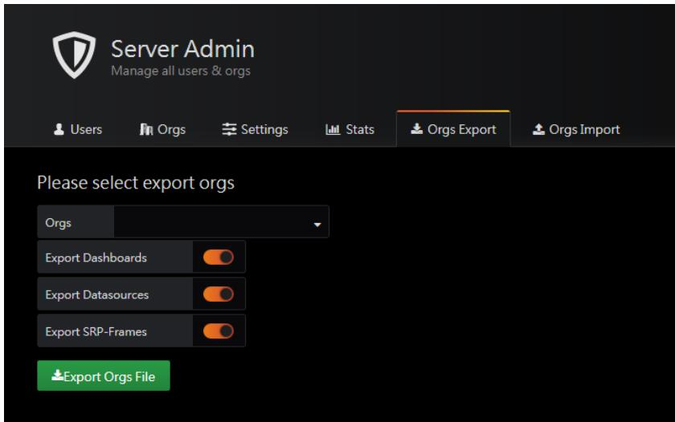

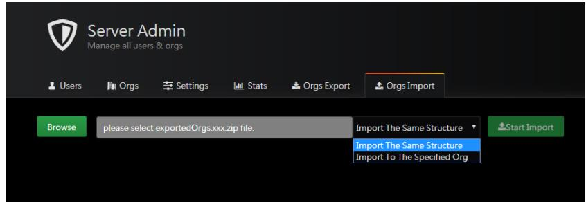

Import The Same Structure 

Import To The Specified Org 

## 功能5 - 变量增强功能

改变Grafana变量只能固定位置的功能，增加变量panel，可装载变量到此panel并放置于dashboard中的任意位置 

新增自定义依赖关系的变量，并支持变量text和id的两种取值模式 

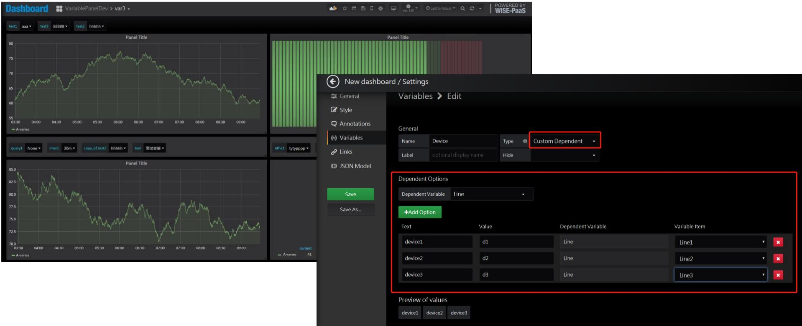

## 功能6 - 显示提升

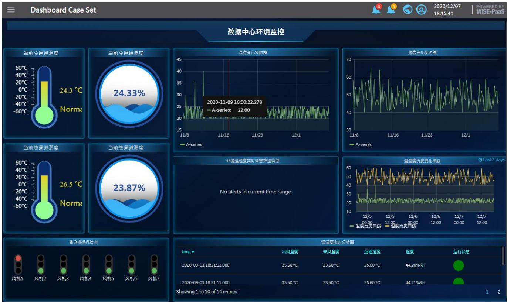

## 背景：

1. 背景颜色可设置 

2. 背景可载入图片 

## 边框：

1. 边框可设置线性粗细 

2. 边框可设置边角 

3. 3种内置模式，可再自定调整 

## Panel Title效果：

1. Title内置10中默认样式，可在此基础上自定义 

2. 颜色阴影效果可配置 

## 大屏Title Panel：

1. 多种内置样式可供选择 

2. 进一步灵活设置 

## 功能7 - 通知功能支持微信和短信

Alert产生的告警事件结合
Notification 进行通知，灵活的告警分派策略，可以将不同应用、级别、内容的告警分配给不同的人员， 

slack pagerduty
VictorOps OpsGene
email webhook 

通知方式新增微信和短信的通知，可配置不同的分组测试，不同的通知方式进行通知： 

2 

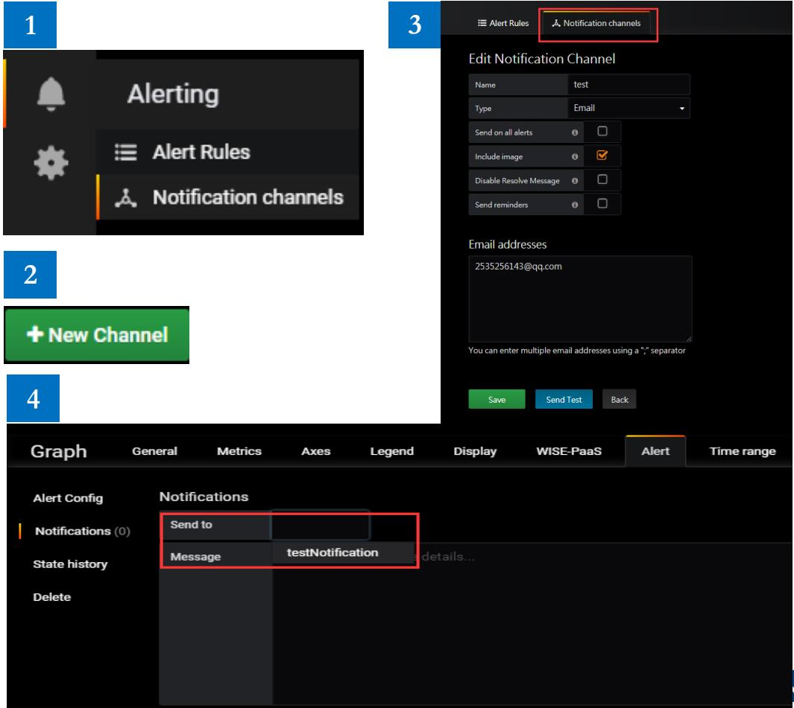

## 功能8 - 多设备分辨率支持

SRP-Frame框架构建的I.App应用和Dashboard支持战情室大屏大分辨率的显示2K, 4K, 8K，支持PC日常管理使用，目前在移动装置上也同样支持，方便您随时随地查看您的I.App应用。优化点： 

1. 既有针对大分辨率进行适配 

2. 针对大屏一屏显示所有内容，提供高度自适应的机制 

3. 在移动端针对众多panel的显示进行适配，符合移动端端的显示效果 

4. 调整Panel的字体可针对不同显示设备动态调整到合适大小 

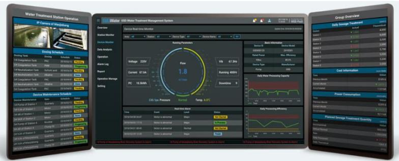

大屏战情室

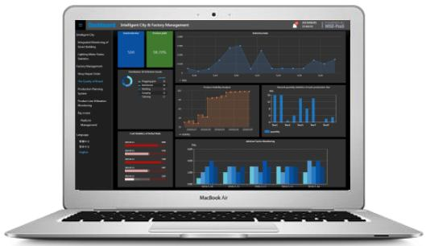

PC

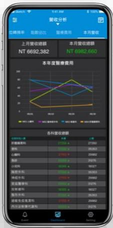

手机

## 功能9 - Dashboard多语言支持

## 第四阶段

## 系统多语言支持：@Q1 (2021)

Dashboard自己的各个操作界面的语言支持多语言，如用户管理，系统配置，org管理页面，dashboard setting等。抽取语言文件，增加多语言，定义不同的语言文件，根据切换的语言加载对应的语言文件替换界面上的显示 

## 第三阶段

## Dashboard页面支持多语言：（已支持）

可支持一套Dashboard的配置适用多套语言下的显示，只需要调整多语言差异的部分，比如文本。切换语言可自动加载对应语言的差异性配置部分。 

## Data Source 支持多语言：（已支持）

## 第二阶段

在SRP-Frame切换语言时，对应所有panel的数据查询会带上语言的参数lang给数据源，例如：/query?lang=en，数据源即可根据当前的语言回传相应语言下的数据 

## 第一阶段

## SRP-Frame支持多语言：（已支持）

SRP-Frame 支持新增一套语言的配置，菜单树支持配置对应语言的显示，并可在界面上进行语言切换，可动态增加多个。同时需要制作此语言对应的 dashboard，包括panel上的title，所有文字配置的部分要支持多语言。 

国际化  
吸引更多海外客户  
目前已有海外客户： 

韩国 

日本 

印度 

马来西亚 

欧洲 

Other 

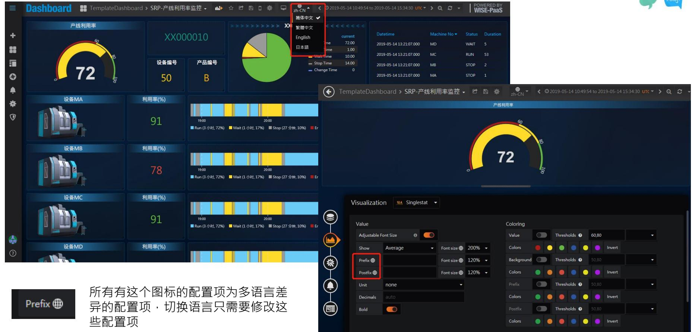

## 功能9 - Dashboard多语言支持

所有有这个图标的配置项为多语言差异的配置项，切换语言只需要修改这些配置项 

## 功能10 - 整合WISE-PaaS SSO 支持单点登录

支持平台角色自动登录：
订阅号admin
订阅号user
Workspace owner
Namespace developer 

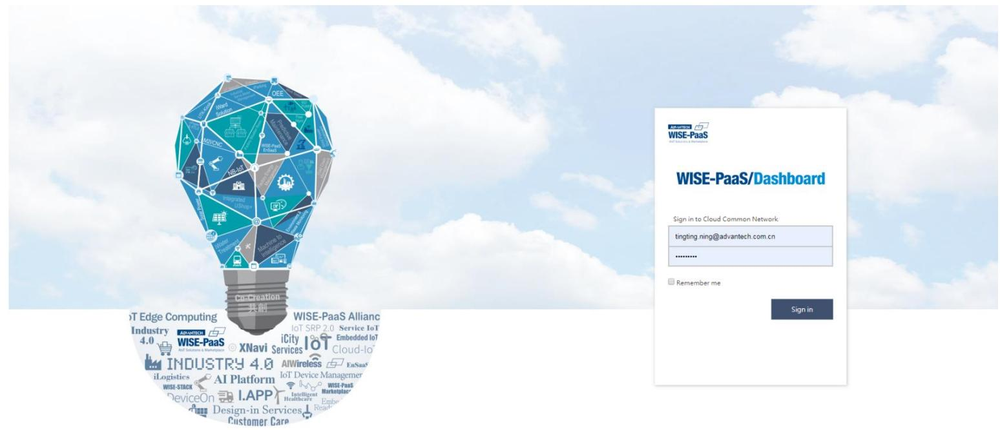

© 1983-2020 Advantech Co., Ltd.

## 新增低代码应用构建框架SRP-Frame

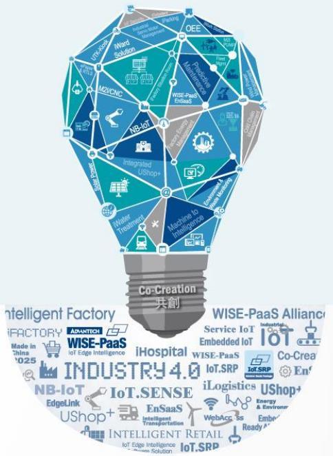

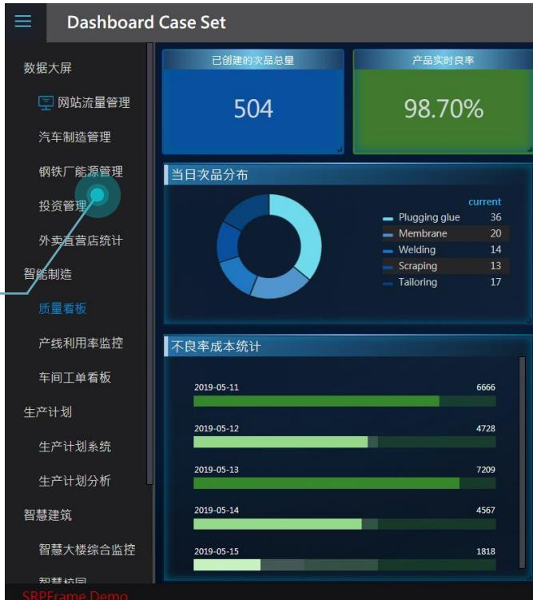

## SRP-Frame简介

背景介绍：随着dashboard的成熟化，客户已经可以独立制作多个dashboard，进一步针对多个dashboard需要有一个总览的选单，方便实时观察与分析，SRP-Frame主要是提供一有结构的目录导引系统，让客户能够将dashboard有结构的呈现。 

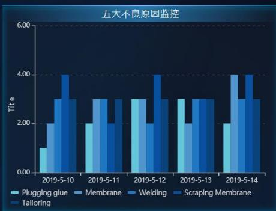

2020/10/22 14:47:28 POWERED BY WISE-PaaS

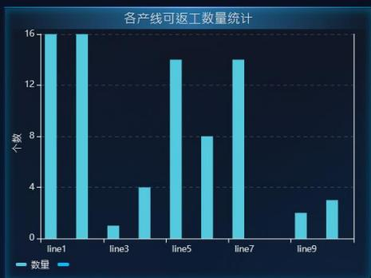

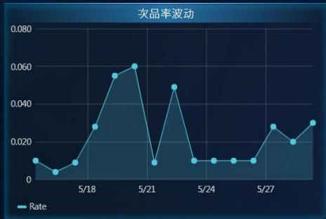

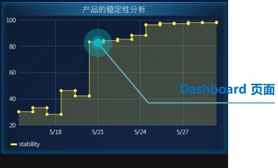

## SRP-Frame功能特点

支持更换Logo 

支持自定义Title 

红色铃铛支持接入告警事件 

黄色铃铛支持接入通知事件 

支持API或WebSocket接入 

支持累加和清零 

支持自定义左侧菜单，支持多级子菜单 

支持菜单添加小图标 

支持定义不同语言的菜单项 

支持菜单展开和合住 

支持使能用户登录检查 

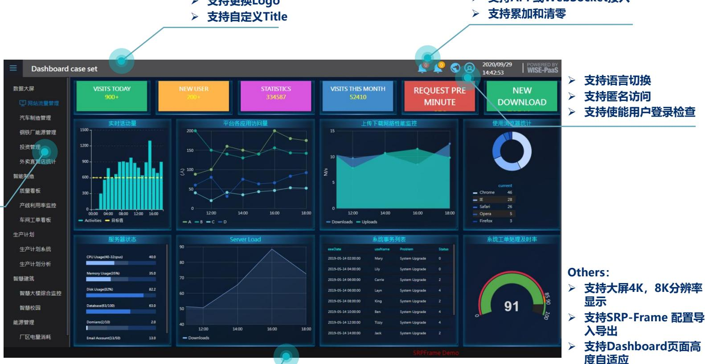

支持跑马灯显示 

支持自定义文本 

支持接入API获取跑马灯内容 支持大屏4K，8K分辨率显示 

支持SRP-Frame 配置导入导出 

支持Dashboard页面高度自适应 

## SRP-Frame低代码配置界面

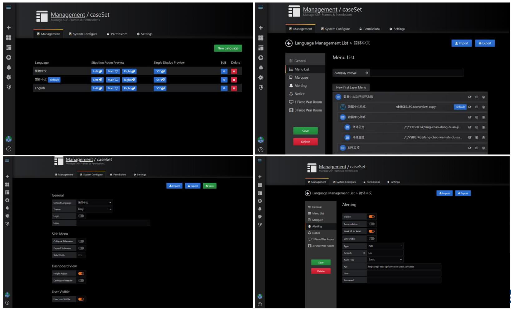

## 三片屏幕Dashboard展示(高阶版)

## Focal Point

<table><tr><td colspan="4">放流口現場影像</td></tr><tr><td colspan="4">加藥排程</td></tr><tr><td>Dosing Tank</td><td>Dosing</td><td>Schedule</td><td>Status</td></tr><tr><td>1# Coagulation Tank</td><td>PAC</td><td>2018/02/12</td><td>Pending</td></tr><tr><td>2# Coagulation Tank</td><td>PAM</td><td>2018/02/22</td><td>Progressing</td></tr><tr><td>1# Neutralization Tank</td><td>Sulfuric acid</td><td>2018/03/23</td><td>Pending</td></tr><tr><td>2# Neutralization Tank</td><td>Alkaline</td><td>2018/03/25</td><td>Done</td></tr><tr><td>3# Coagulation Tank</td><td>PAC</td><td>2018/04/01</td><td>Pending</td></tr><tr><td>2# Neutralization Tank</td><td>Alkaline</td><td>2018/03/25</td><td>Done</td></tr><tr><td>3# Coagulation Tank</td><td>PAC</td><td>2018/04/01</td><td>Pending</td></tr><tr><td colspan="4">維護保養排程</td></tr><tr><td>Device Maintenance</td><td>Item</td><td>Schedule</td><td>Status</td></tr><tr><td>1# Pump of Station 1</td><td>Quarterly</td><td>2018/02/12</td><td>Pending</td></tr><tr><td>1# VJA of Station 1</td><td>Motor</td><td>2018/02/22</td><td>Progressing</td></tr><tr><td>2# AR of Station 1</td><td>Motor</td><td>2018/03/23</td><td>Pending</td></tr><tr><td>2# SAR of Station 2</td><td>Motor</td><td>2018/03/25</td><td>Done</td></tr><tr><td>3# Pump of Station 4</td><td>Routine</td><td>2018/04/01</td><td>Pending</td></tr><tr><td>3# AR of Station 4</td><td>Chang Oil</td><td>2018/03/13</td><td>Progressing</td></tr><tr><td>2# VJA of Station 5</td><td>Quarterly</td><td>2018/03/23</td><td>Pending</td></tr><tr><td>1# VJA of Maojiabang</td><td>Quarterly</td><td>2018/03/25</td><td>Done</td></tr><tr><td>2# VJA of Maojiabang</td><td>Quarterly</td><td>2018/04/01</td><td>Pending</td></tr><tr><td>3# VJA of Maojiabang</td><td>Chang Oil</td><td>2018/03/13</td><td>Progressing</td></tr></table>

## Interactive Dashboard

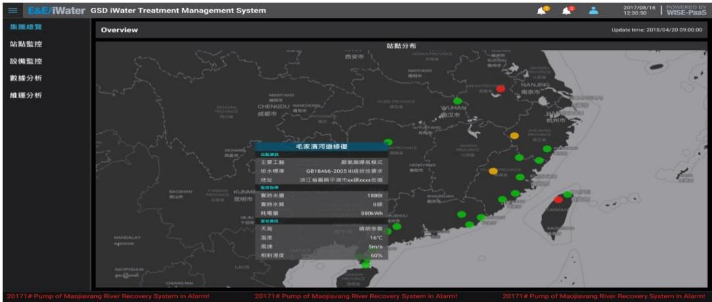

## M. Scorecard

<table><tr><td colspan="3">放流口管理指標</td></tr><tr><td colspan="3">日常汗水進流水量(單位1)</td></tr><tr><td>汗水處理站</td><td>實際值</td><td>目標值</td></tr><tr><td>Station 1</td><td>▼1,882</td><td>4,000</td></tr><tr><td>Station 2</td><td>▼3,752</td><td>5,000</td></tr><tr><td>Station 3</td><td>▼1,051</td><td>3,200</td></tr><tr><td>Station 4</td><td>▲2,498</td><td>2,000</td></tr><tr><td>Station 5</td><td>▼1,847</td><td>3,700</td></tr><tr><td>Station 6</td><td>▼3,122</td><td>5,000</td></tr><tr><td>Station 7</td><td>▼1,061</td><td>3,200</td></tr><tr><td>Station 8</td><td>▲2,198</td><td>2,000</td></tr><tr><td colspan="3">汗水進流費用統計(單位RMB)</td></tr><tr><td>時間指標</td><td colspan="2">達成值</td></tr><tr><td>上個月費用</td><td colspan="2">5189.6</td></tr><tr><td>本月費用</td><td colspan="2">▼2419.5</td></tr><tr><td>本年度累積費用</td><td colspan="2">110168</td></tr><tr><td colspan="3">耗電量統計統計(單位kWh)</td></tr><tr><td>時間指標</td><td colspan="2">達成值</td></tr><tr><td>上個月耗電量</td><td colspan="2">8289.6</td></tr><tr><td>本月耗電量</td><td colspan="2">▼9924.5</td></tr><tr><td>本年度累積耗電量</td><td colspan="2">521168</td></tr><tr><td colspan="3">汗水進流量指標(單位1)</td></tr><tr><td>時間指標</td><td colspan="2">實際值</td></tr><tr><td>全年累積量</td><td colspan="2">500,005</td></tr><tr><td>已完成累積量</td><td colspan="2">1,500,000</td></tr><tr><td>實際達成率</td><td colspan="2">▲31.5%</td></tr><tr><td>每日實際量</td><td colspan="2">1565.5</td></tr><tr><td>每日目標量</td><td colspan="2">3722</td></tr></table>

## 单台设备焦点资讯

(中阶管理者、一般操作者)
监控影像画面、Snapshot
单点细部报表呈现 

## 互动智能业绩数据报表

(中阶管理者、一般操作者)
主选单: 功能互动与配置、分析报表、资料追踪
警报推播: 发现问题、预防问题、解决问题 

## 总体关键绩效指标

(高阶管理者) 

关键累积指标KPI 

提高策略性決策 

SRP-Frame可支持左中右三片式显示，分别对应三个独立的url，左右两边支持轮播功能，中间互动页面可进行互动操作，搭配战情室硬件可打造用户自己的监控战情室 

20171# Pump of Maojiavang River Recovery System in Alarm! 

## 单片荧幕Dashboard展示(基础版)

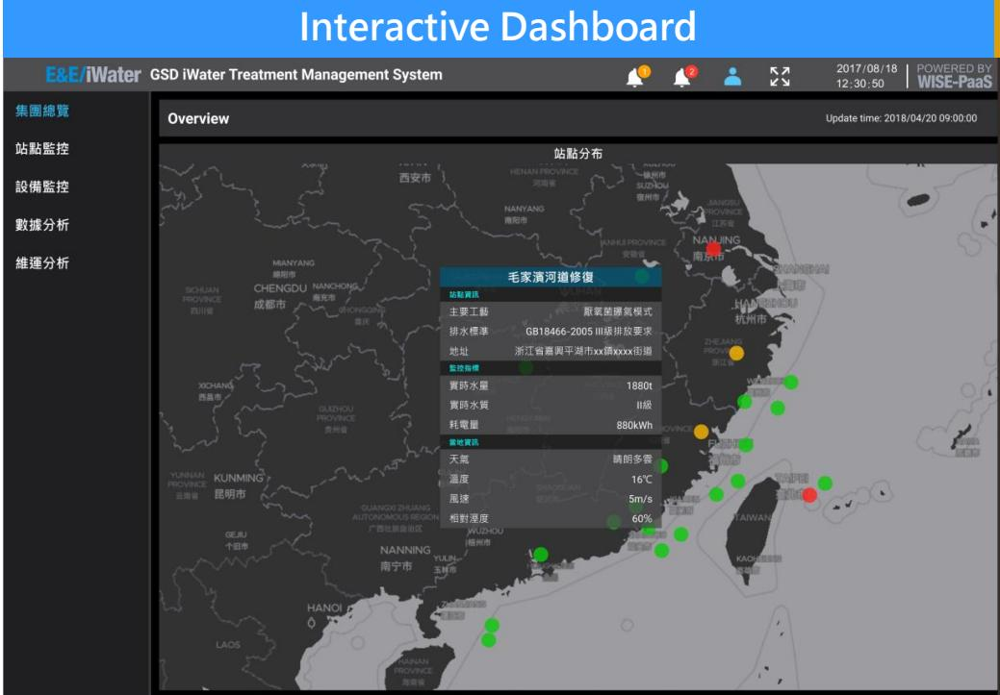

SRP-Frame支持55寸的显示模式，只需要在Url后面带上layout=ss的参数即可切换到单片荧幕的显示模式。 

配合55寸，86寸屏幕可展示单屏的战情室。 

20171# Pump of Maojiavang River Recovery System in Alarm!

<table><tr><td colspan="2">日常汗水進流水量</td><td>(單位:元)</td><td colspan="2">汗水進流費用統計</td><td>(單位:RMB)</td><td colspan="2">耗電量統計統計</td><td>(單位:kWh)</td><td colspan="2">汗水進流量指標</td></tr><tr><td>汗水處理站</td><td>實際值</td><td>目標值</td><td>時間指標</td><td>達成值</td><td>時間指標</td><td>達成值</td><td>時間指標</td><td>時間指標</td><td>實際值</td><td></td></tr><tr><td>Station 1</td><td>▼1,882</td><td>4,000</td><td>上個月費用</td><td>5189.6</td><td>上個月耗電量</td><td>8289.6</td><td>全年累積量</td><td>500,005</td><td></td><td></td></tr><tr><td>Station 2</td><td>▼3,722</td><td>5,000</td><td>本月費用</td><td>▼2419.1</td><td>本月耗電量</td><td>▼5924.1</td><td>已完成累積量</td><td>1,500,000</td><td></td><td></td></tr><tr><td>Station 3</td><td>▼1,051</td><td>3,200</td><td>本年度累積費用</td><td>110168</td><td>本年度累積耗電量</td><td>521168</td><td>實際達成率</td><td>▲31.5%</td><td></td><td></td></tr></table>

## 搭配战情室硬体－实物效果

高阶版设备(86" x1,55" x2)

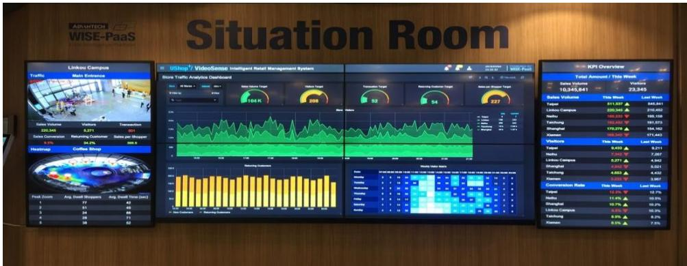

基础版设备(55" x1)

55" LCD 

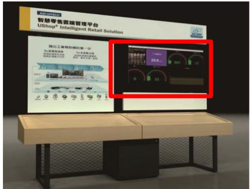

Enabling an Intelligent Planet 

## 移动端排版和Mobile App支持

## I.App Mobile APP

I. App Mobile APP 为我们推出的SRP-Frame构建的应用的通用mobile APP。用于在手机上方便查看SRP-Frame页面，具有以下特点： 

直接连接自己在PC端构建好的I.App应用，不用修改SRP-Frame的配置。 

如果想在mobile有更好的呈现效果，我们推荐把dashboard页面针对Mobile重新排版，所见即所得。 

➢ 不只研华的I.App, 客户自己用SRP-Frame构建的应用也可以使用此APP，即刻拥有自己应用的Mobile APP 

App Event 支持WISE-PaaS/Dashboard 中Alert产生的事件接入 

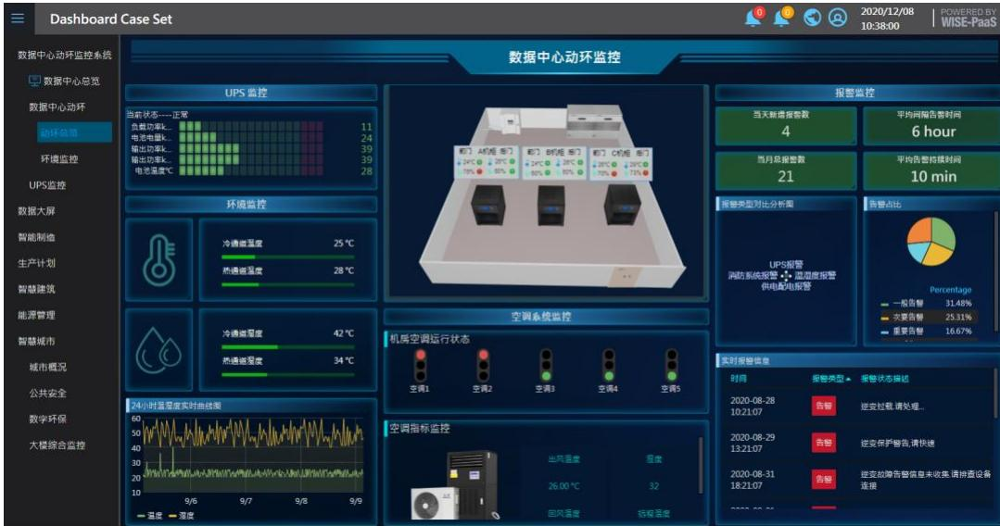

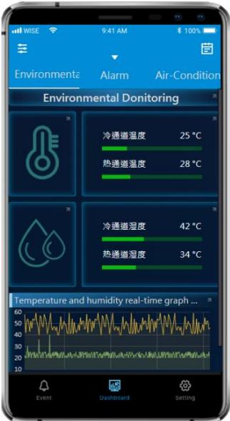

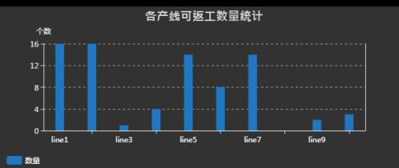

## Dashboard Mobile APP

WISE-PaaS/Dashboard Mobile APP 是WISE-PaaS/Dashboard的Mobile 版本，用于在手机上方便查看Dashboard页面。如果您只查看Dashboard的页面而不是SRP-Frame的页面请使用此APP 

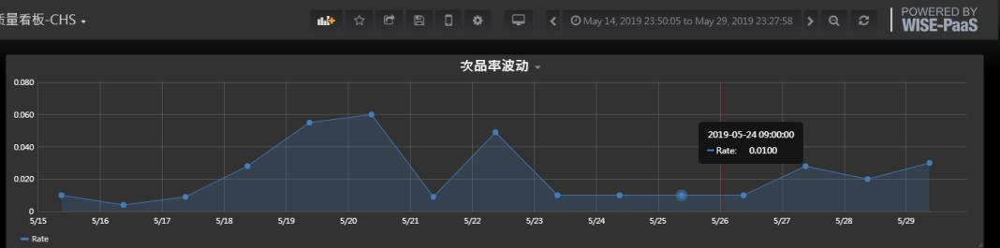

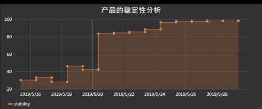

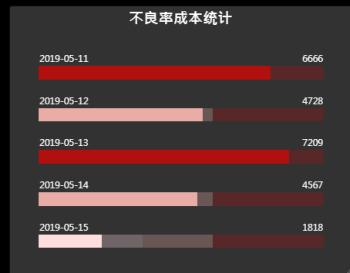

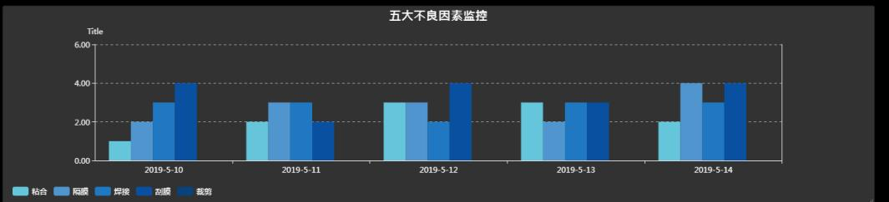

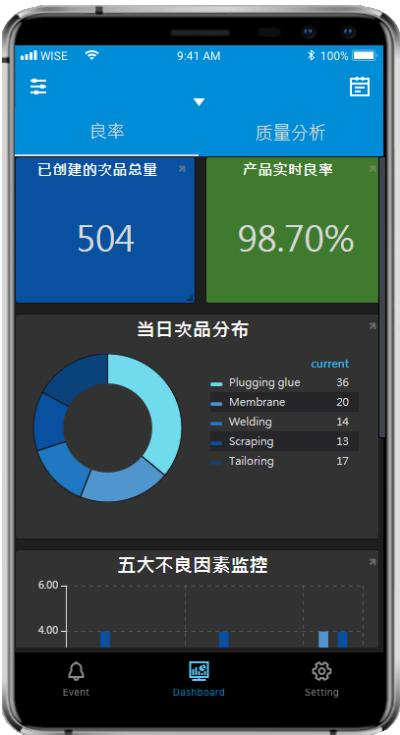

## 针对移动端的排版

## 为了让手机端的dashboard有更好的显示效果，我们推荐用户在PC端针对dashboard进行mobile显示排版：

我们推荐将大量的数据资讯『群组化』的方式呈現在移动端设备的小屏幕中，可通过建立Group分组。 

可根据自己的喜好把panel移动到指定群组中。 

每个群组都可分别依据自己喜好进行布局。 

如果不重新排版布局默认是流式布局，每个panel纵向排列下来。 

Step.1 Mobile View Mode 

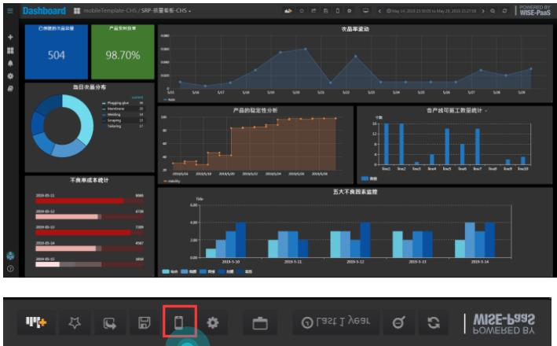

Step.2 Layout Setting

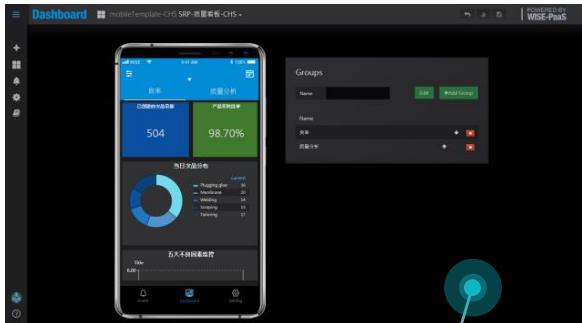

Mobile的排版页面，建立Group，可对panel分组

Step.3 Finished

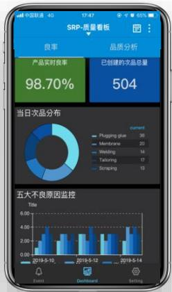

从PC页面跳转到mobile的排版页面

## Mobile群组化排版

## PC端针对dashboard 进行mobile 群组化排版，所见即所得

由dashboard PC端，点击“mobile view mode”进入排版页面 

Group Tab分类的意义在于将同属性的panel分门别类，通过手机切换帮助使用者有效的进行资料的对比与浏览 

提供群组的添加，删除，编辑功能，调换顺序，Group的名字不建议过长 

每个Group内，建议不要超过5个panel 

提供panel的拖拉修改大小，移动位置布局 

Panel可移动到指定群组 

点击群组名称可进行切换 

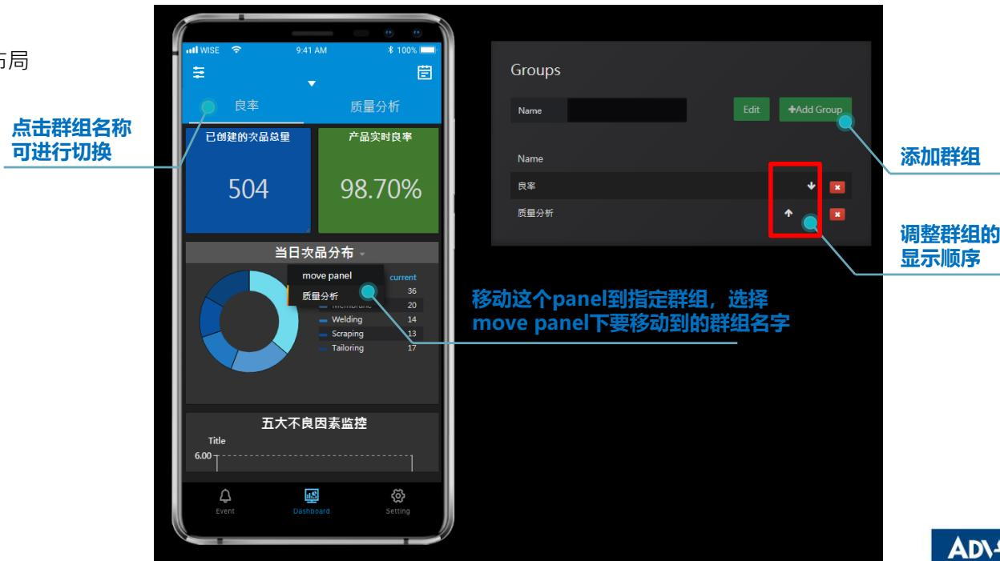

## Mobile群组化排版范例

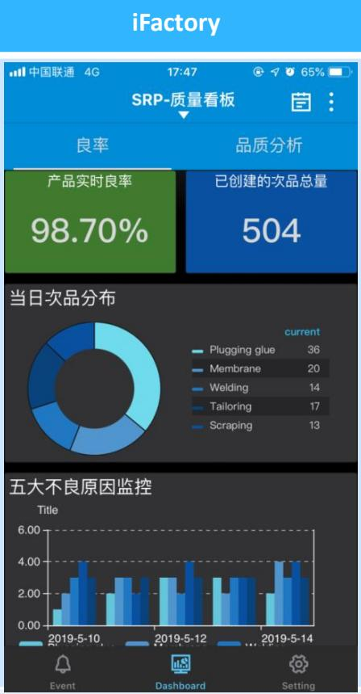

范例1

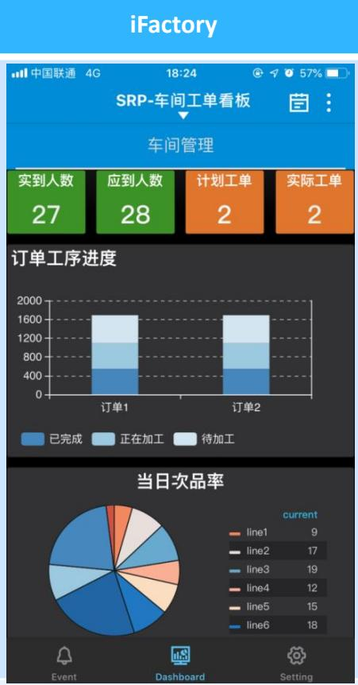

范例2

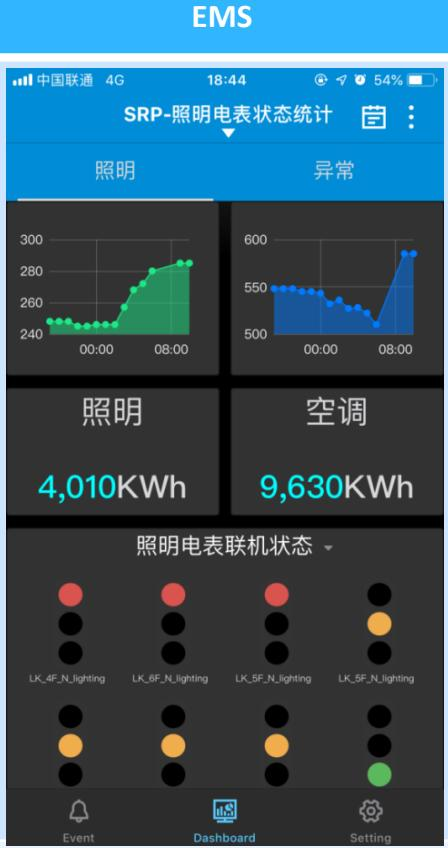

范例3

## I.App Mobile App下载

## iOS版本

已在Apple App Store应用商店上架, 可搜索WISE-PaaS/I.App关键字查找下载 

- APP Name : I.App 

- APP 下载：可至Apple App Store 下载 

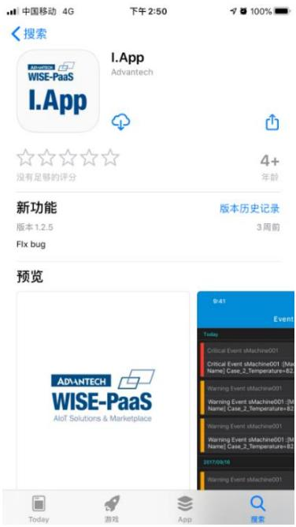

## Android版本：

- 已在google Play Store上架，请搜索IWISE-PaaS/I.App下载 

- 已在小米应用商店上架，请搜索WISE-PaaS/I.App下载 

- 已在华为应用商店上架，请搜索WISE-PaaS/I.App下载 

- 提供固定二维码扫描下载 

## WISEPAA WISE-PaaS I.App

## Dashboard Mobile App下载

## iOS版本

已在Apple App Store应用商店上架, 可搜索WISE-PaaS/Dashboard 关键字查找下载 

- APP Name : WISE-PaaS/Dashboard 

- APP 下载：可至Apple App Store 下载 

wise-paas/dashboard 

取消 

WISE-PaaS/Dashboard
工具 

## Android版本：

- 已在google Play Store上架，请搜索WISE-PaaS/Dashboard下载 

- 已在小米应用商店上架，请搜索WISE-PaaS/Dashboard下载 

- 提供固定二维码扫描下载 

- 已在华为应用商店上架，请搜索WISE-PaaS/Dashboard下载 

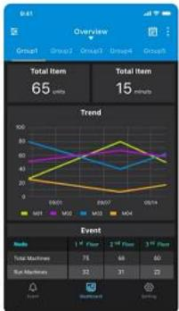

## Dashboard

Enabling an Intelligent Planet 

## 新增25支各行业的显示插件

## 25个新增插件效果

## Work Order – 显示设备图片和当前的运行数据

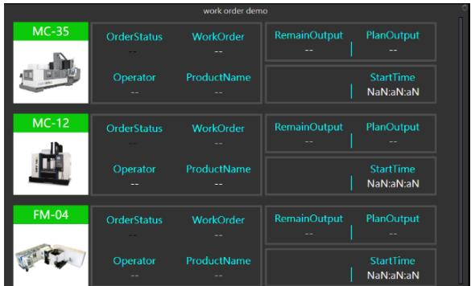

Advanced Datatable - 搜索，状态灯，row 控制，填入表格

<table><tr><td colspan="6">Panel Title</td></tr><tr><td rowspan="2">Time ▼</td><td colspan="2">Title</td><td rowspan="2">●(○)</td><td rowspan="2">AT-Status</td><td rowspan="2">Num-Status</td></tr><tr><td>AT</td><td>Num</td></tr><tr><td>2019-12-24 10:58:13</td><td>67.00</td><td>92.73</td><td>96</td><td>●</td><td>●</td></tr><tr><td>2019-12-24 10:58:02</td><td>67.00</td><td>92.73</td><td>96</td><td>●</td><td>●</td></tr><tr><td>2019-12-24 10:57:52</td><td>67.00</td><td>92.73</td><td>96</td><td>●</td><td>●</td></tr><tr><td>2019-12-24 10:57:42</td><td>67.00</td><td>92.73</td><td>96</td><td>●</td><td>●</td></tr><tr><td>2019-12-24 10:57:32</td><td>67.00</td><td>92.73</td><td>96</td><td>●</td><td>●</td></tr><tr><td>2019-12-24 10:57:22</td><td>67.00</td><td>92.73</td><td>96</td><td>●</td><td>●</td></tr><tr><td>2019-12-24 10:57:12</td><td>67.00</td><td>92.73</td><td>96</td><td>●</td><td>●</td></tr><tr><td>2019-12-24 10:57:02</td><td>67.00</td><td>92.73</td><td>96</td><td>●</td><td>●</td></tr><tr><td>2019-12-24 10:56:52</td><td>67.00</td><td>92.73</td><td>96</td><td>●</td><td>●</td></tr><tr><td>2019-12-24 10:56:42</td><td>67.00</td><td>92.73</td><td>96</td><td>●</td><td>●</td></tr></table>

Grouped Bar Chart – 多功能的曲线图和柱状图，状态阈值，柏拉图 

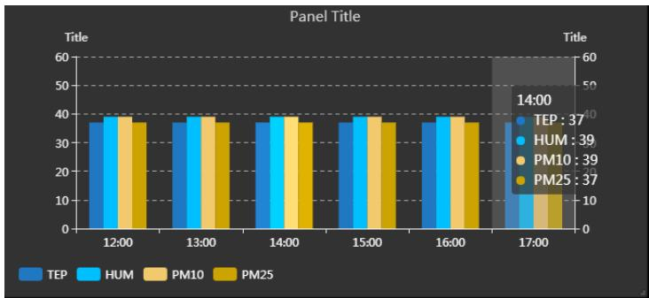

Alarm Tracking – 接入DataHub的Alarm数据显示

<table><tr><td colspan="12">Panel Title</td></tr><tr><td colspan="12">Acknowledge all</td></tr><tr><td>Alarm Code</td><td>SCADA</td><td>Device</td><td>Tag</td><td>Message</td><td>Alarm Time</td><td>Value</td><td>Ack Time</td><td>Ack Status</td><td>ACK</td><td></td><td></td></tr><tr><td>tag1~20x=700</td><td>100tag@simulator3</td><td>P01_dev</td><td>A03</td><td>tag2~20x=700</td><td>2019-11-08 13:58:02</td><td>500</td><td>2019-11-11 16:04:28</td><td>Asked</td><td></td><td></td><td></td></tr><tr><td>tag3~20x=700</td><td>100tag@simulator3</td><td>P01_dev</td><td>A04</td><td>tag3~20x=700</td><td>2019-11-08 13:41:21</td><td>500</td><td>2019-11-11 16:04:25</td><td>Asked</td><td></td><td></td><td></td></tr><tr><td>tag3~20x=700</td><td>100tag@simulator3</td><td>P01_dev</td><td>A05</td><td>tag3~20x=700</td><td>2019-11-08 13:41:21</td><td>500</td><td>2019-11-11 14:36:15</td><td>Asked</td><td></td><td></td><td></td></tr><tr><td>tag3~20x=700</td><td>100tag@simulator3</td><td>P01_dev</td><td>A06</td><td>tag3~20x=700</td><td>2019-11-08 13:41:21</td><td>500</td><td>2019-11-11 16:04:20</td><td>Asked</td><td></td><td></td><td></td></tr><tr><td>tag3~20x=700</td><td>100tag@simulator3</td><td>P01_dev</td><td>A07</td><td>tag3~20x=700</td><td>2019-11-08 13:41:21</td><td>500</td><td>2019-11-11 16:04:31</td><td>Asked</td><td></td><td></td><td></td></tr></table>

## 25个新增插件效果

- Infographic – 图片+ 统计表格显示 

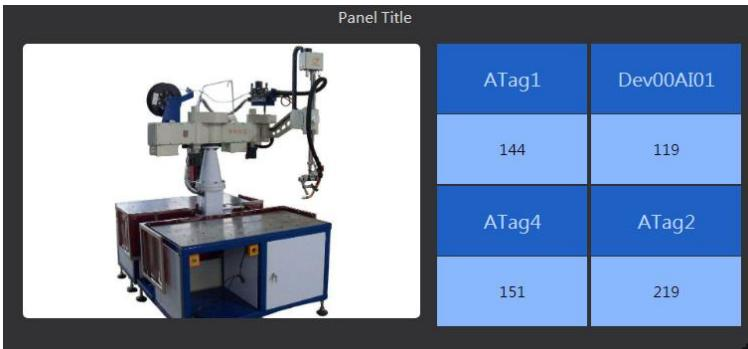

- Machine Temp – 设备稳定的多维度显示

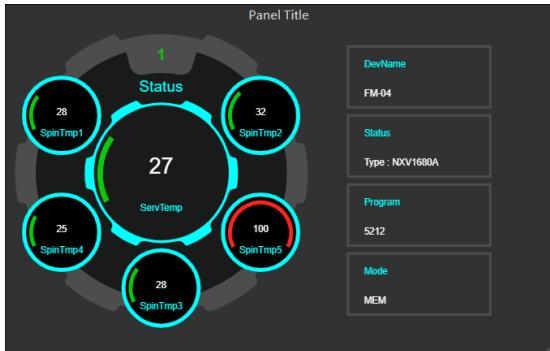

Machine information – 设备的基本信息和图片显示

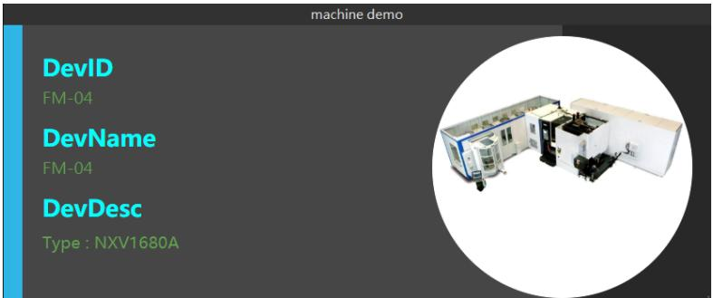

Monitor Panel – 多维度有层次的数据监控显示

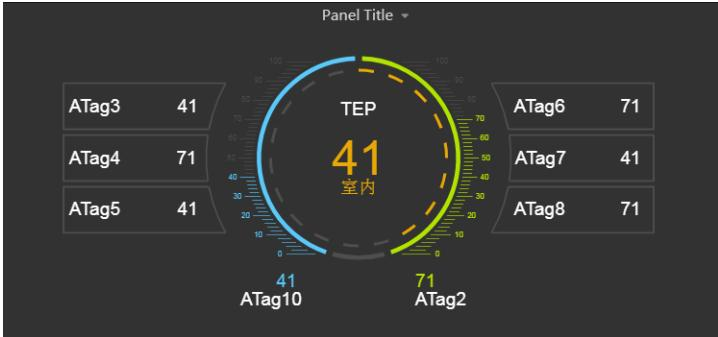

## 25个新增插件效果

## - Ranking Bar – 排行显示效果

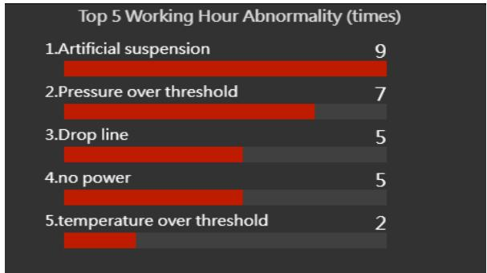

- Sankey Panel – 可用于能源流动或者人员流动情况的现象展示

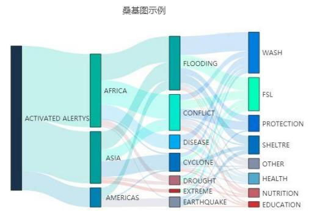

## • Patient Card – 病人信息和科室已经重点监控状态

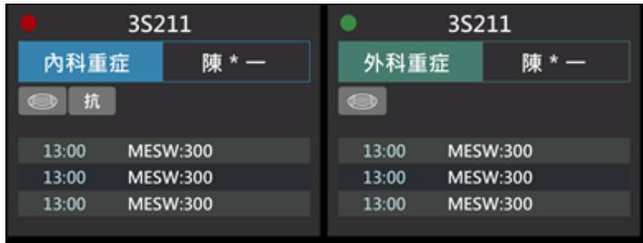

- Rader Chart – 雷达图，多维度的数据显示分析

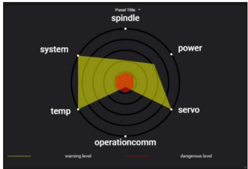

## 25个新增插件效果

## - TimelineList – 多组设备的当前运行状况

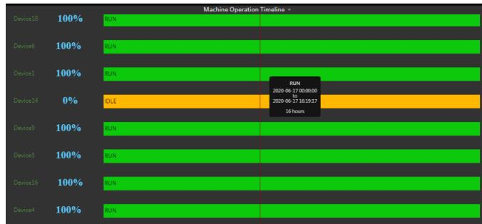

## Worldmap Card – 地图+卡片的显示效果

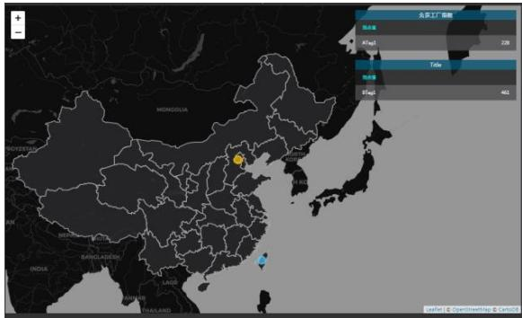

progress bar – 当前的进度情况，可设置阈值 

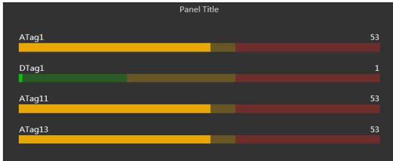

## - Multistat – 多个状态的数据显示

PlannedPcs / ActualPcs / ActRate 

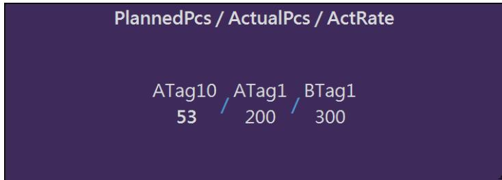

ATag10 / ATag1 / BTag1
53 200 300 

## 25个新增插件效果

• Water Achieving Rate - 用于以圆形与水位的方式显示数值的达成率 

- Water Flow In-Out - 用于以柱状图方式显示两笔数据当前值以及误差值警示 

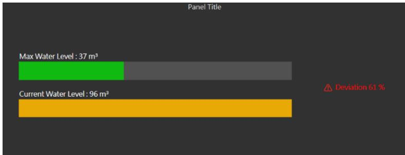

Water pump status - 显示当前水位与设备启动状态(支援1~4台设备) 

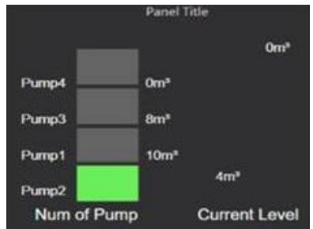

- Water Statistic - 显示Tag的环比数据(仅对Query回来的数据进行呈现、不在前端作计算) 

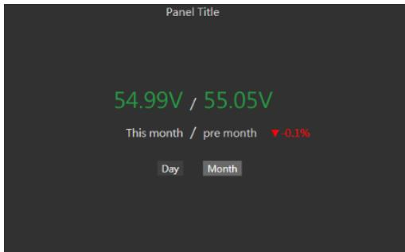

## 25个新增插件效果

- Control Panel Funnel Panel – 用于对数据源反向控制写入数据 

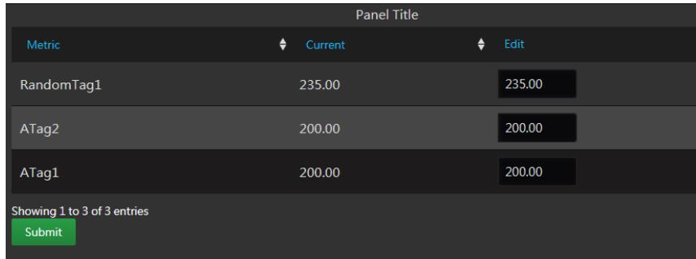

- Funnel Panel - 漏斗图适用于业务流程多的流程分析，显示各流程的转化率 

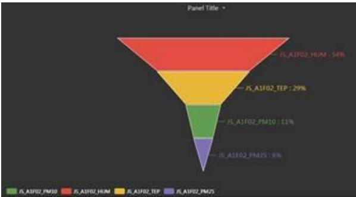

- APM Switch panel - 用户动态多设备或群组的动态 dashboard配置 

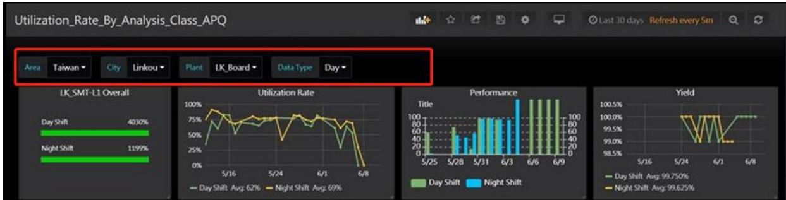

川源(中国)智慧云平台 

## 25个新增插件效果 – VideoSense + Dash Video panel 支持视频接入

√ 多协议(RTMP, HLS, DASH) 

√ 实时画面 

√ 历史回放 

√ 子码流直播选项 

√ 视频转码 

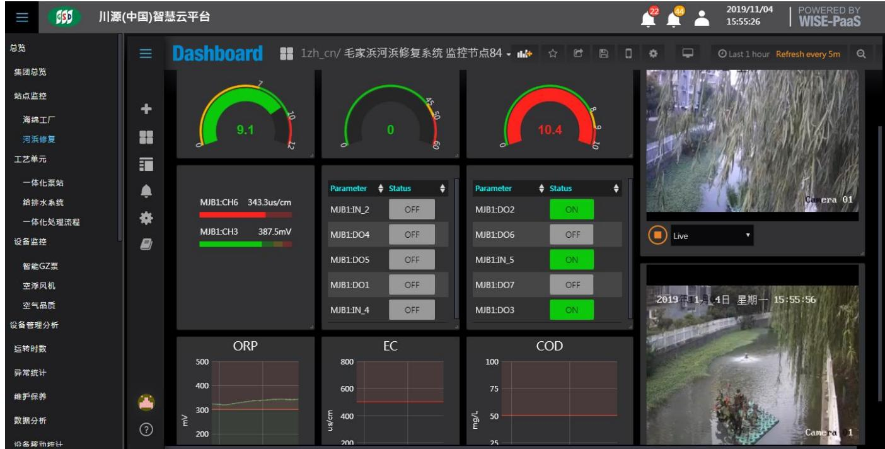

## 新增插件效果 – SaaS Composer Viewer

WISE-PaaS/Dashboard

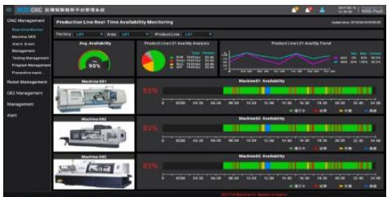

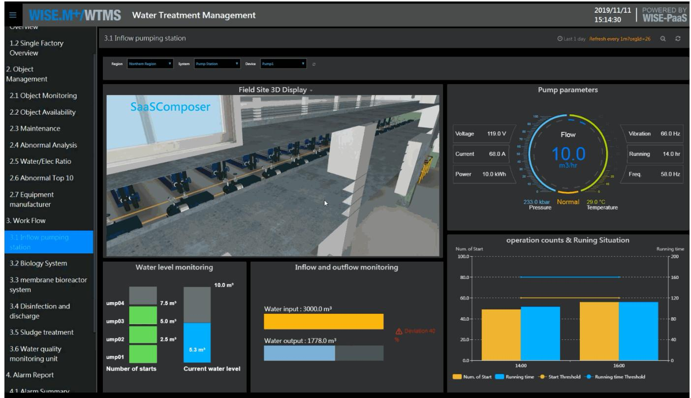

## WISE-PaaS/SaaS Composer

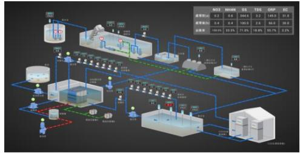

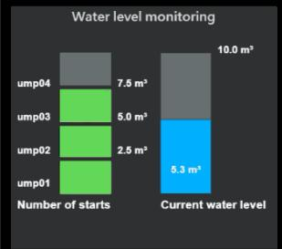

## 新增9支数据源插件，无缝接入平台数据

## 9个新增数据源接入插件－平台数据无缝整合

<table><tr><td>数据源名称</td><td>描述</td></tr><tr><td>InsightAPM datasource</td><td>接入InsightAPM数据,接入资产绩效管理系统的数据显示</td></tr><tr><td>DataHub datasource</td><td>接入DataHub数据,接入各种IoT设备,闸道器和系统等产生的大量时间序列数据</td></tr><tr><td>DeviceOn datasource</td><td>接入DeviceOn数据,接入各类设备监控的数据</td></tr><tr><td>M+datasource</td><td>接入WISE M+数据,用于显示智能设备管理,实时监控设备的数据,应用于环境和能源管理领域</td></tr><tr><td>AFS datasource</td><td>接入AIFS数据,用于展示AFS训练后存储在Model Repository的模型绩效指标值</td></tr><tr><td>iFactory EAM datasource</td><td>接入iFactory数据,用于展示智慧工厂收集的数据</td></tr><tr><td>WebAccess datasource</td><td>接入WebAccess数据,用于展示各类工业现场采集的数据</td></tr><tr><td>UShop datasource</td><td>接入UShop数据,用于展示智能零售案场手机的经营数据</td></tr><tr><td>MongoDB datasource</td><td>接入MongoDB数据,通过部署一个代理接入数据</td></tr></table>

## 和平台其它服务深度整合

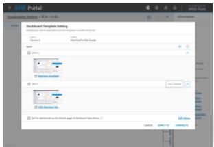

## InsightAPM 整合

1. 提供Device，ProductLine，Group多层级的Dashboard自动生成 

2. APM和OEE模板，自定义模板 

3. 移动端整合 

4. 开发3 支插件 

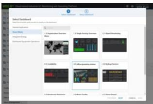

## WISE.M+ 整合

1. 自动生成水处理，能源管理的应用 

2. 开发5个插件 

3. 数据源动态提供配置 

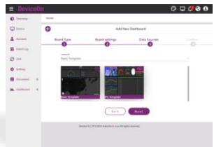

## DeviceOn 整合

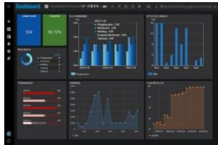

1. 提供Device Dashboard自动生成 

2. 开发数据插件接入数据 

3. 用户管理权限串接 

## DataHub 整合

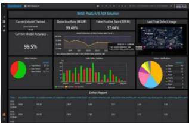

1. 开发datasource数据源接入 

2. 开发插件展示Alarm 

3. Control panel 反向控制 

## WebAccess整合

1. Local端和WebAccess绑定发布 

2. 用户管理整合 

3. 开发数据源插件，接入数据 

4. Mobile App 支持WebAccess本地用户登录使用 

## AIFS 整合

1. 开发AIFS datasource接入数据  
2. 展示AFS训练后模型绩效指标值 

3. 结合Dashboard展现AFS的结果  
页面直观查看效果 

## 平台数据无缝接入可视化，对平台客户数据上云即可直接接入制作方案

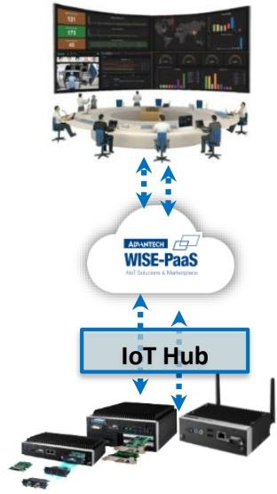

快速可复制，根据模板自动生成，设备监控页面，水处理解决方案等 

## Template

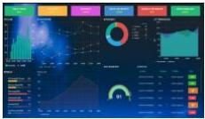

Enabling an Intelligent Planet 

## 17支增强或维护的第三方插件

## 17个优化和维护的官方或第三方插件

第三方插件的功能增强 

第三方插件支持更多类型的数据源 

第三方插件的
bug修改 

第三方插件和 grafana 不同版本的兼容 

<table><tr><td>Panel</td><td>优化or维护</td><td>Panel</td><td>优化or维护</td></tr><tr><td>Graph</td><td>新增列算式计算数据功能,数据时间自适应功能,新增统计控制线UCL, CL, LCL,离散统计功能,新增数据按天统计</td><td>Traffic Lights panel</td><td>行数很多时的显示优化</td></tr><tr><td>Singlestat</td><td>新增自定义算式计算数据功能,Alert</td><td>gauge-panel</td><td>修复图片加载和卡死的bug</td></tr><tr><td>Multistat Bar Chart</td><td>新增timeseris 数据源的支持</td><td>Bubblechart panel</td><td>修复图片加载不出来的bug</td></tr><tr><td>Status panel</td><td>新增多个查询数据的显示</td><td>Radar panel</td><td>Grafana 6.0以上版本适配</td></tr><tr><td>Histogram</td><td>新增SPC 统计控制线的功能</td><td>FlowCharting</td><td>Grafana 6.0以上版本适配</td></tr><tr><td>Pie Chart</td><td>新增table数据源的支持,新增圆环显示效果和当前值显示</td><td>Diagram</td><td>Grafana 6.0以上版本适配</td></tr><tr><td>PictureIt</td><td>图片显示可选图片上传的结果,可显示告警效果</td><td>WindRose</td><td>Grafana 6.0以上版本适配</td></tr><tr><td>Worldmap Panel</td><td>增加平台Datahub和DeviceOn数据的接入支持</td><td>Plotly-New</td><td>显示bug 修改</td></tr><tr><td>Discrete</td><td>修复legend显示的问题,优化显示</td><td></td><td></td></tr></table>

Enabling an Intelligent Planet 

## 插件商城，插件开发生态

## 微生态 — WISE-PaaS/Dashboard插件商城

## Plugin Marketplace

Catalog | Console ∨ | Resource ∨ 

## WISE-PaaS/Dashboard

## < IoTSuite

Essential tools for building cloud native industrial applications... 

## I.App Team

Chorothmap Panel

Dispatch Service
1.2.3

Scatter Map Panel

Hydrograph Panel

## Dashboard Team

Thermometer Panel

## Get Free Trial Now

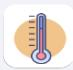

## User Ecosystem

## 价值交换

## 欢迎加入

## DFSI

End User 

## 上架精品插件打造插件商城

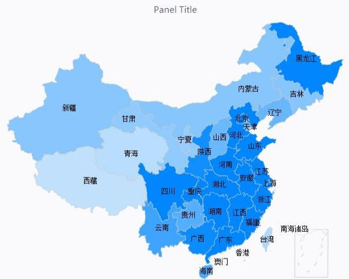

## 分级地图

- 可显示分级图，根据不同的数据显示不同的颜色分布，如疫情分布图。 

- 分布图可以在地图上通过更立体的显示和气泡标注来显示各省份数据 

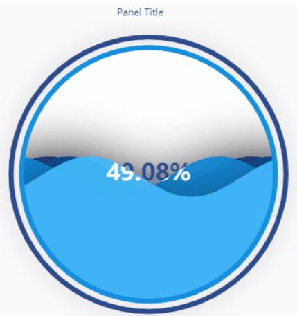

## 水位图

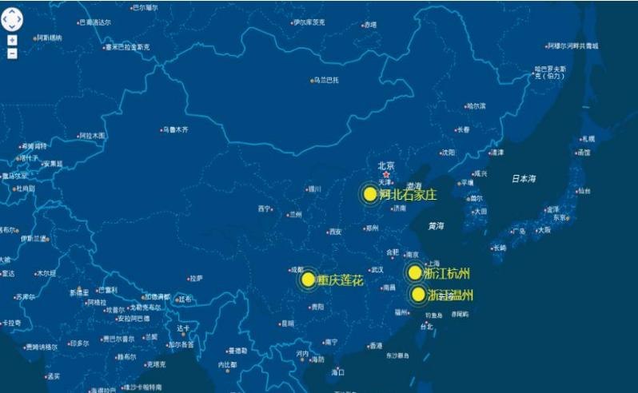

- 支持字体大小和保留小数点个数设置 

- 支持自定义计算区间最大值，结合当前数据计算百分比 

- 支持多域值和颜色设置，可根据需要添加不同的域值区间展示不同的业务含义 

## 客制化地图

- 可按需设置水域，陆地，边界,行政名称的颜色 

- 可显示数据点散射，气泡的效果 

- 可显示数据点 Marker跳动效果 

## 温度计

- 灵活的刻度设置支持最大最小刻度值设置，支持刻度区间设置 

- 支持温度的阈值区间自定义 

- 支持字体的大小设置和温度单位的设置 

# 完善的培训和技术资料 技术支持和客制化开发

## 完善的培训和技术资料

51篇中英文手册，覆盖基本功能，数据源，panel,SRP-Frame，Mobile各个功能 

7个视频培训教程，覆盖功能讲解，插件开发，API Server开发 

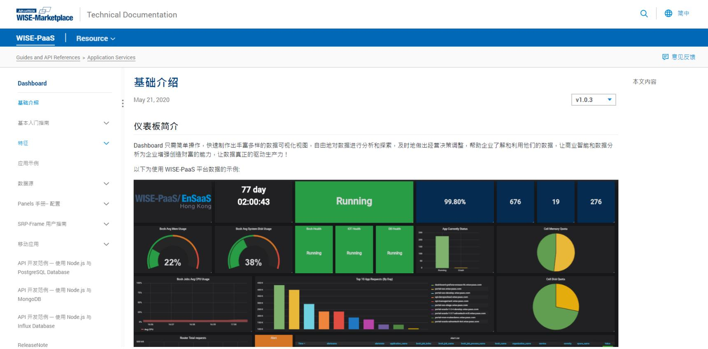

## 快速响应的客户支持服务

— CUSTOMER SUPPORT — 

## 来源

## Dashboard SE

多来源的技术支持渠道 

5*8的技术问题支持 

问题的持续跟踪直到解决 

问题解决的进版更新通知 

## Consulting Services 服务

提供Consulting Services 服务，按照需要的人力评估NRE的费用，主要支持以下几类： 

1. 客制化的插件需求开发，技术熟练，可快速交付 

2. 核心功能的客制化需求 

3. 可视化方案评估实施 

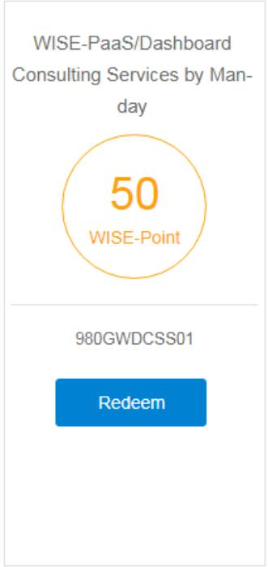

确认清楚需求规格  
快速评估可行性  
评估需要开发用时

50
WISE-Point 

980GWDCSS01 

Redeem 

评估 

根据最终需求进行开发按照规格详细测试 

报价 

开发&测试 交付 

根据评估天数进行合理报价价钱讨论敲定 

按时完成交付
提供高质量的交付成果 

Go Together,
We Go Far and Grow Big 

